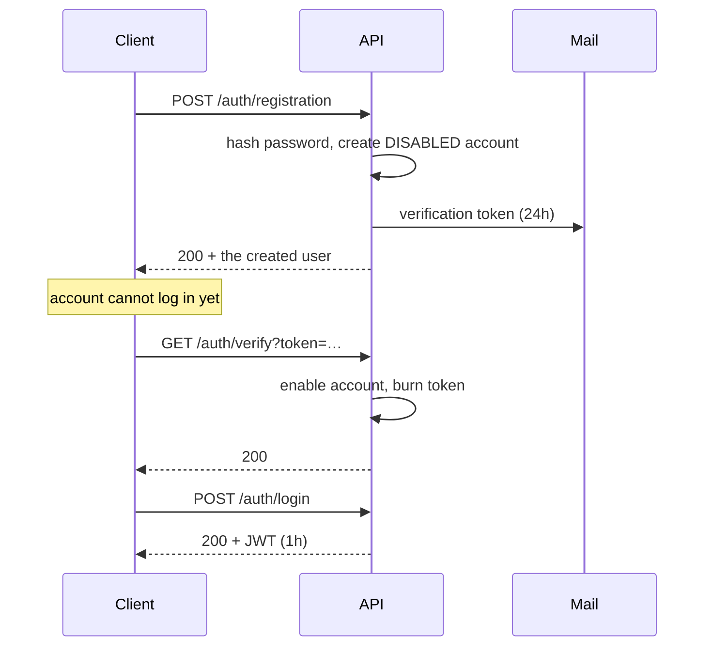
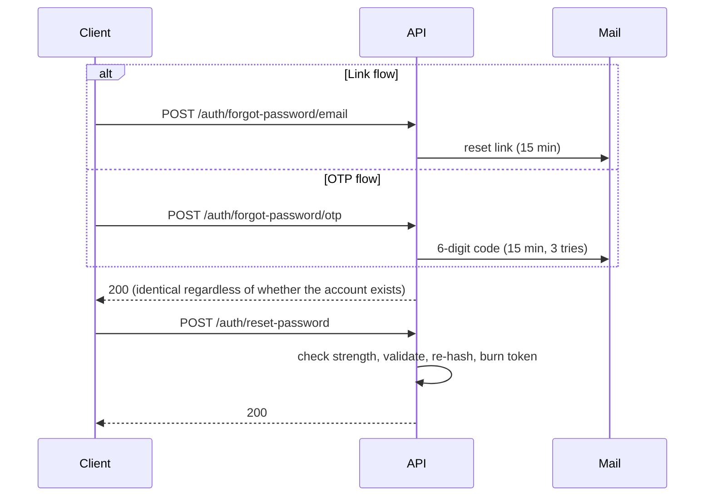

# Authentication

Everything under `/auth/**` is public. Everything else needs a bearer token from `POST /auth/login`.

```
Authorization: Bearer <token>
```

## The registration flow



The account is created **disabled**. Until the token is used, `POST /auth/login` refuses it.

---

## `POST /auth/registration`

Create an account.

**Request**

```json
{
  "username": "helloworld",
  "email": "test@gmail.com",
  "password": "admin123"
}
```

| Field | Rules |
|---|---|
| `username` | Required, non-blank, unique |
| `email` | Required, valid address, unique |
| `password` | Required, non-blank — **no strength rules apply here** |

**Responses**

| Status | When |
|---|---|
| `200` | Created, verification email dispatched |
| `400` | Validation failed — body carries the offending fields |
| `500` | Email already registered, or the mail server was unreachable |

:::warning The response body leaks secrets
This endpoint returns the whole `User` entity, which includes the **BCrypt password hash** and the **verification token**:

```json
{
  "id": 1,
  "password": "$2a$10$HqgA60KmLNFh34j0TFX7V…",
  "verificationToken": "bd7ce86a-7b1c-478c-b0fe-a458d3ee5055",
  …
}
```

Anyone who can see the response can verify the account without access to the mailbox. Do not surface this body to end users. See [known issues](../reference/known-issues.md).
:::

:::note Weak passwords are accepted at sign-up
`RegisterUserDto` only enforces `@NotBlank`. The uppercase/digit/special-character rules exist solely on `POST /auth/reset-password`, so `a` is a valid registration password but an invalid reset password.
:::

---

## `POST /auth/login`

Exchange credentials for a JWT. **Authentication is by email**, not username.

**Request**

```json
{
  "email": "test@gmail.com",
  "password": "admin123"
}
```

**Response** — `200`

```json
{
  "token": "eyJhbGciOiJIUzI1NiJ9…",
  "expiresIn": 3600000
}
```

`expiresIn` is milliseconds (`JWT_EXPIRATION_MS`). The token's subject claim is the user's **email**.

| Status | When |
|---|---|
| `200` | Authenticated |
| `401` | Bad credentials, or the account is not verified |

---

## `GET /auth/verify?token=…`

Enable an account using the emailed token. Checks the expiry date, enables the account, and clears the token so it cannot be reused.

| Status | Body |
|---|---|
| `200` | `Email verified successfully. You can now login.` |
| `400` | `Invalid or expired verification token` |

---

## `GET /auth/registrationConfirm?token=…`

The older confirmation route, backed by the `verification_token` table rather than the column on `app_user`.

| Status | Body |
|---|---|
| `200` | `Your account has been successfully activated. You can now login.` |
| `400` | `Invalid verification token` |

:::warning Two verification paths, two different tokens
Registering once produces **two unrelated tokens** for the same account:

| Token | Stored in | Checked by | Emailed? |
|---|---|---|---|
| `472098eb-…` | `app_user.verification_token` | `GET /auth/verify` | ✅ yes |
| `ee162fd2-…` | `verification_token` table | `GET /auth/registrationConfirm` | ❌ no |

`AuthenticationService.signup` writes the column, then `RegistrationListener` independently generates a *second* UUID for the table. The verification email carries the first one.

So `/auth/registrationConfirm` rejects the token users actually receive:

```bash
$ curl "http://localhost:8080/auth/registrationConfirm?token=472098eb-…"
Invalid verification token          # 400

$ curl "http://localhost:8080/auth/verify?token=472098eb-…"
Email verified successfully.        # 200
```

**Use `/auth/verify`.** `/auth/registrationConfirm` only accepts the table token, which no user is ever given, and it does not check expiry. See [known issues](../reference/known-issues.md).
:::

---

## Password reset

Two flows, same ending. Pick a link (`/forgot-password/email`) or a code (`/forgot-password/otp`), then finish at `/reset-password`.



### `POST /auth/forgot-password/email` · `POST /auth/forgot-password/otp`

```json
{ "email": "user@example.com" }
```

| Status | When |
|---|---|
| `200` | Request accepted |
| `429` | Too many attempts for this address |

:::tip The 200 tells you nothing about the account
Both endpoints answer `200` with the same message whether or not the address is registered. That is deliberate — it stops the endpoint being used to enumerate accounts.

- email → `If an account exists with this email, you will receive a password reset link shortly.`
- otp → `If an account exists with this email, you will receive a verification code shortly.`
:::

Rate limiting is per address **and** per flow: `PASSWORD_RESET_MAX_ATTEMPTS` (5) within `PASSWORD_RESET_ATTEMPT_WINDOW_MINUTES` (60). The link and code flows have separate budgets.

### `POST /auth/reset-password`

Supply **either** `token` or `otp` — not both.

```json
{ "token": "your-reset-token-here", "otp": null, "newPassword": "NewSecurePassword123!" }
```

```json
{ "token": null, "otp": "123456", "newPassword": "NewSecurePassword123!" }
```

The new password must satisfy **all** of:

- at least `PASSWORD_MIN_LENGTH` characters (8)
- one uppercase letter
- one digit
- one special character

| Status | When |
|---|---|
| `200` | Password changed |
| `400` | Weak password, missing/invalid/expired/used token, or wrong OTP |
| `500` | Unexpected failure while saving |

Tokens are single-use and expire after `PASSWORD_RESET_EXPIRY_MINUTES` (15). An OTP is burned after `PASSWORD_RESET_MAX_OTP_ATTEMPTS` (3) wrong guesses. `PasswordResetTokenCleanupTask` sweeps expired rows hourly.

---

## Using the token

```bash
JWT=$(curl -s -X POST http://localhost:8080/auth/login \
  -H 'Content-Type: application/json' \
  -d '{"email":"test@gmail.com","password":"admin123"}' | jq -r .token)

curl http://localhost:8080/users/me -H "Authorization: Bearer $JWT"
```

A missing, malformed or expired token gets **`403`**, not `401` — see [Errors](./errors.md).
