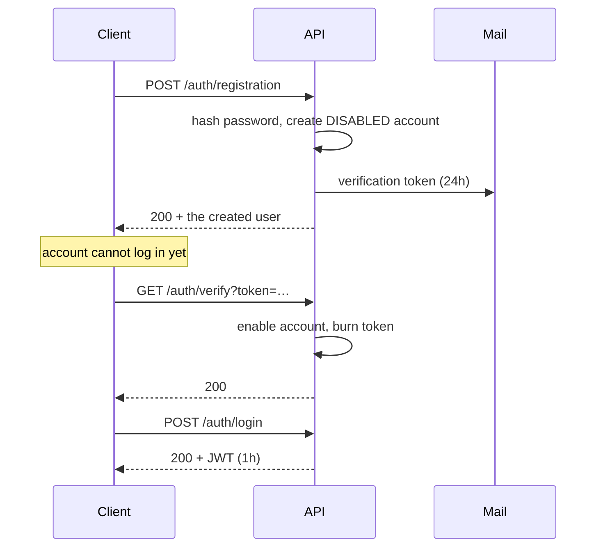
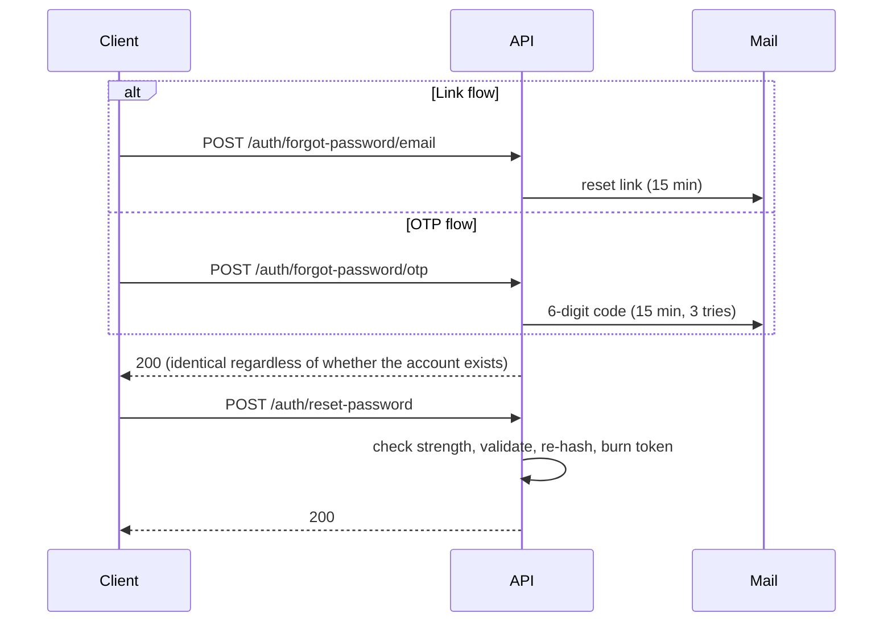

# Authentication

Everything under `/auth/**` is public. Everything else needs a bearer token from `POST /auth/login`.

```
Authorization: Bearer <token>
```

## The registration flow



The account is created **disabled**. Until the token is used, `POST /auth/login` refuses it.

---

## `POST /auth/registration`

Create an account.

**Request**

```json
{
  "username": "helloworld",
  "email": "test@gmail.com",
  "password": "StrongPass1!"
}
```

| Field | Rules |
|---|---|
| `username` | Required, non-blank, unique |
| `email` | Required, valid address, unique |
| `password` | Required, and must pass the same strength rules as password reset |

**Response** — `200`

```json
{
  "id": 1,
  "username": "helloworld",
  "email": "test@gmail.com",
  "firstName": null,
  "lastName": null,
  "enabled": false,
  "roles": ["USER"],
  "autoReactivationEnabled": true,
  "createdAt": "2026-08-04T00:33:42.692+00:00",
  "updatedAt": "2026-08-04T00:33:42.692+00:00"
}
```

The account is created with the `USER` role and stays `enabled: false` until verified.

| Status | When |
|---|---|
| `200` | Created, verification email dispatched |
| `400` | Validation failed, or the password is too weak |
| `409` | Username or email already registered |
| `500` | The mail server was unreachable |

:::info No credentials in the response
This used to return the raw `User` entity, hash and verification token included — which let anyone who saw the response activate the account without the mailbox. It now returns a projection that omits `password`, `verificationToken` and `expiryDate`. See [known issues](../reference/known-issues.md).
:::

:::note Password rules apply here too
`admin123` is rejected: registration and reset share one definition of strong — 8+ characters with an uppercase letter, a digit and a special character. Registration used to accept anything non-blank.
:::

---

## `POST /auth/login`

Exchange credentials for a JWT. **Authentication is by email**, not username.

**Request**

```json
{
  "email": "test@gmail.com",
  "password": "StrongPass1!"
}
```

**Response** — `200`

```json
{
  "token": "eyJhbGciOiJIUzI1NiJ9…",
  "expiresIn": 3600000
}
```

`expiresIn` is milliseconds (`JWT_EXPIRATION_MS`). The token's subject claim is the user's **email**.

| Status | When |
|---|---|
| `200` | Authenticated |
| `401` | Bad credentials, or the account is not verified |

---

## `GET /auth/verify?token=…`

Enable an account using the emailed token. Checks the expiry date, enables the account, and clears the token so it cannot be reused.

| Status | Body |
|---|---|
| `200` | `Email verified successfully. You can now login.` |
| `400` | `Invalid or expired verification token` |

---

## `GET /auth/registrationConfirm?token=…`

The older confirmation route, backed by the `verification_token` table rather than the column on `app_user`.

| Status | Body |
|---|---|
| `200` | `Your account has been successfully activated. You can now login.` |
| `400` | `Invalid verification token` |

:::note Both verification endpoints accept the emailed token
`/auth/verify` reads `app_user.verification_token`; `/auth/registrationConfirm` reads the `verification_token` table. Registration writes **the same value** to both, so either endpoint works with the token from the email, and both check expiry.

They used to hold two different UUIDs — `RegistrationListener` generated its own for the table — so `/auth/registrationConfirm` rejected the token users were actually sent. See [known issues](../reference/known-issues.md).
:::

---

## Password reset

Two flows, same ending. Pick a link (`/forgot-password/email`) or a code (`/forgot-password/otp`), then finish at `/reset-password`.



### `POST /auth/forgot-password/email` · `POST /auth/forgot-password/otp`

```json
{ "email": "user@example.com" }
```

| Status | When |
|---|---|
| `200` | Request accepted |
| `429` | Too many attempts for this address |

:::tip The 200 tells you nothing about the account
Both endpoints answer `200` with the same message whether or not the address is registered. That is deliberate — it stops the endpoint being used to enumerate accounts.

- email → `If an account exists with this email, you will receive a password reset link shortly.`
- otp → `If an account exists with this email, you will receive a verification code shortly.`
:::

Rate limiting is per address **and** per flow: `PASSWORD_RESET_MAX_ATTEMPTS` (5) within `PASSWORD_RESET_ATTEMPT_WINDOW_MINUTES` (60). The link and code flows have separate budgets.

### `POST /auth/reset-password`

Supply **either** `token` or `otp` — not both.

```json
{ "token": "your-reset-token-here", "otp": null, "newPassword": "NewSecurePassword123!" }
```

```json
{ "token": null, "otp": "123456", "newPassword": "NewSecurePassword123!" }
```

The new password must satisfy **all** of:

- at least `PASSWORD_MIN_LENGTH` characters (8)
- one uppercase letter
- one digit
- one special character

| Status | When |
|---|---|
| `200` | Password changed |
| `400` | Weak password, missing/invalid/expired/used token, or wrong OTP |
| `500` | Unexpected failure while saving |

Tokens are single-use and expire after `PASSWORD_RESET_EXPIRY_MINUTES` (15). An OTP is burned after `PASSWORD_RESET_MAX_OTP_ATTEMPTS` (3) wrong guesses. `PasswordResetTokenCleanupTask` sweeps expired rows hourly.

---

## Using the token

```bash
JWT=$(curl -s -X POST http://localhost:8080/auth/login \
  -H 'Content-Type: application/json' \
  -d '{"email":"test@gmail.com","password":"StrongPass1!"}' | jq -r .token)

curl http://localhost:8080/users/me -H "Authorization: Bearer $JWT"
```

A missing, malformed or expired token gets **`401`**; a valid token without the right ownership or role gets **`403`**. See [Errors](./errors.md).
