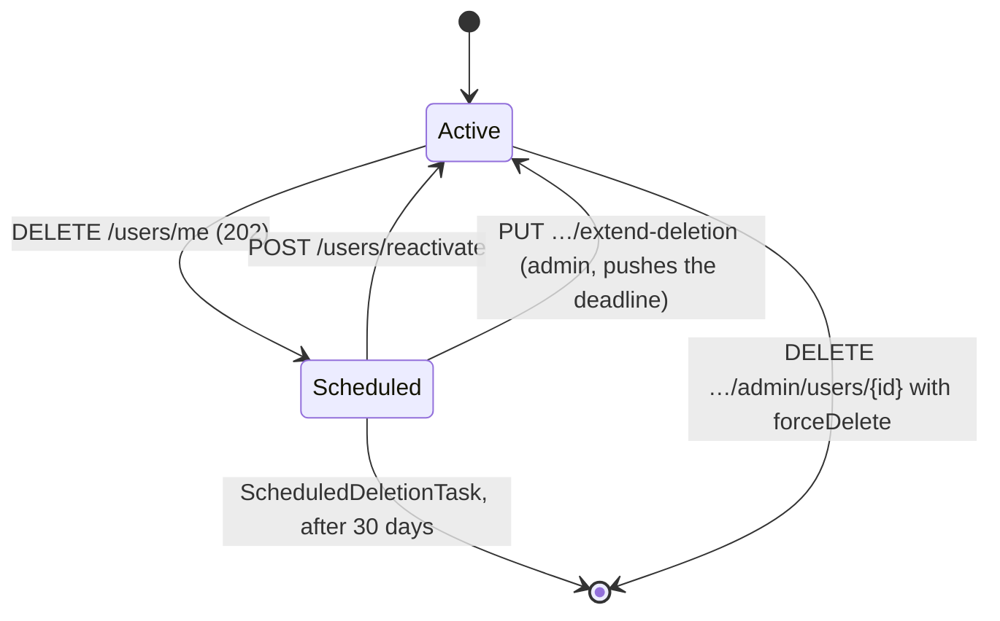

# Users

Base path `/users`. Every endpoint needs `Authorization: Bearer <token>`.

## `GET /users/me`

The caller's profile, resolved from the token.

| Status | When |
|---|---|
| `200` | Returned |
| `403` | Missing or invalid token |

:::warning The response includes the password hash
Like registration, this returns the raw `User` entity — `password` (BCrypt hash), `verificationToken` and all. There is no `UserDto` projection on this path. See [known issues](../reference/known-issues.md).
:::

## `GET /users/`

Every user, unpaginated.

:::caution Mind the trailing slash
The mapping is `@GetMapping("/")` under `@RequestMapping("/users")`, so the path is **`/users/`**. Calling `/users` without it does not match.
:::

## `GET /users/paginated`

Users in the standard [pagination envelope](./pagination.md). Defaults to `?page=0&size=10&sort=id,asc`.

Filters — supplying any one switches to the filtered query, all substring matches:

| Parameter |
|---|
| `username` |
| `email` |
| `firstName` |
| `lastName` |

```bash
curl "http://localhost:8080/users/paginated?page=0&size=20&email=example.com" \
  -H "Authorization: Bearer $JWT"
```

Soft-deleted users are excluded from every query.

---

## Account deletion

Deletion is a two-stage process with a **30-day grace period**, not an immediate removal.



While scheduled, the account is invisible to every query — posts, comments and user listings all filter on `deletedAt IS NULL`.

### `DELETE /users/me`

Soft-delete the caller's account.

```json
{ "autoReactivationEnabled": true }
```

The body is optional — send nothing and the existing preference stands.

**Response** — `202 Accepted`

```json
{
  "message": "Account has been marked for deletion",
  "deletedAt": "2026-08-04T07:54:32",
  "scheduledDeletionAt": "2026-09-03T07:54:32",
  "gracePeriodDays": 30,
  "autoReactivationEnabled": true,
  "additionalInfo": "Your account will be permanently deleted on: …"
}
```

:::note 202, not 204
Deletion is *scheduled*, not done. The `202 Accepted` says the request was taken; the account survives for 30 more days.
:::

A reactivation token valid for 30 days is generated and stored alongside.

### `POST /users/reactivate`

Restore an account inside its grace period.

```json
{ "reactivationToken": "TOKEN_FROM_DELETION_EMAIL" }
```

| Status | When |
|---|---|
| `200` | Reactivated — `Account successfully reactivated` |
| `400` | Unknown token, expired token, or the grace period has passed |

Clears `deletedAt` and `scheduledDeletionAt`, sets `isActive` back to `true`, and consumes the token.

---

## Admin endpoints

All three require `ROLE_ADMIN` (`@PreAuthorize("hasRole('ADMIN')")`). Note the doubled segment — the class maps `/users` and the methods map `/admin/users/…`.

### `DELETE /users/admin/users/{id}`

```json
{ "forceDelete": true }
```

| Body | Effect |
|---|---|
| omitted, or `forceDelete: false` | Soft-delete — `User account marked for deletion` |
| `forceDelete: true` | **Permanent** removal, no grace period — `User permanently deleted` |

| Status | When |
|---|---|
| `200` | Done |
| `403` | Caller lacks `ROLE_ADMIN` |
| `404` | No such user |

### `PUT /users/admin/users/{id}/extend-deletion`

```json
{ "extensionDays": 15 }
```

Pushes `scheduledDeletionAt` further out.

| Status | When |
|---|---|
| `200` | `Deletion grace period extended by 15 days` |
| `400` | `extensionDays` missing or ≤ 0, or the user is not scheduled for deletion |
| `403` | Caller lacks `ROLE_ADMIN` |
| `404` | No such user |

### `GET /users/admin/users/scheduled-deletion`

Accounts whose `scheduled_deletion_at` has already passed — i.e. those the next [`ScheduledDeletionTask`](../architecture/scheduled-tasks.md) run will permanently delete.

:::caution Roles are not seeded
`schema.sql` inserts `ADMIN` and `USER` rows, but registration assigns **no** role, and there is no endpoint to grant one. Every account starts with an empty `roles` set, so nothing can reach these endpoints without a manual `INSERT` into `user_roles`. See [known issues](../reference/known-issues.md).
:::

## There is no profile update endpoint

`UserController` exposes `GET` and `DELETE` on `/users/me` only. `firstName` and `lastName` exist on the entity and are filterable, but nothing writes them after registration.
