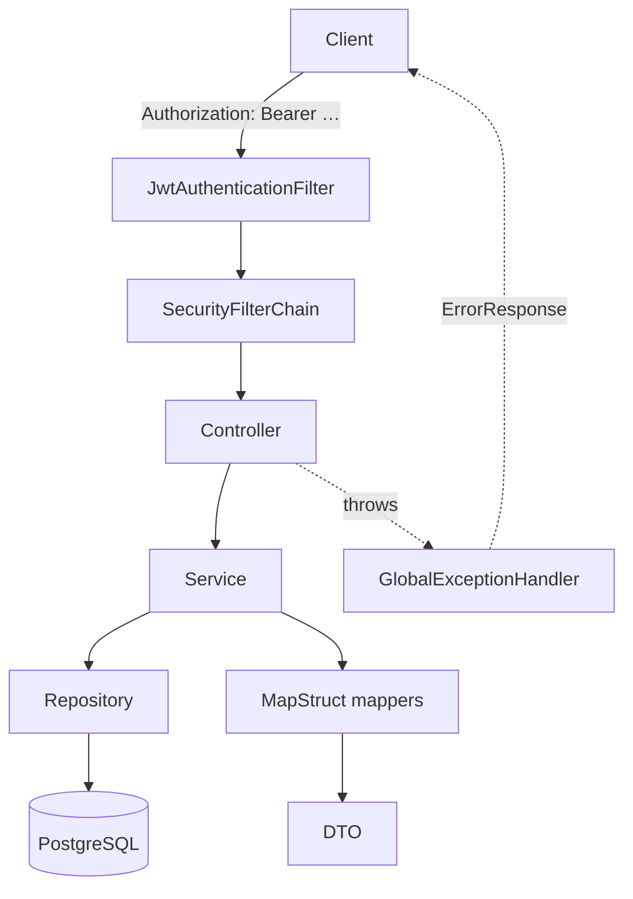
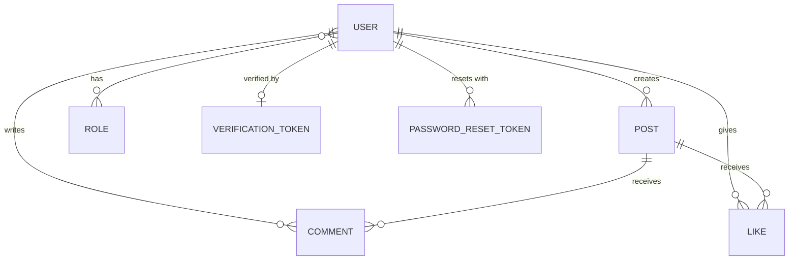

# Architecture

A conventional Spring Boot layering: HTTP in at the controller, business rules in the service, persistence in the repository, and MapStruct converting between entities and DTOs.



## The layers

| Layer | Package | Responsibility |
|---|---|---|
| **Controller** | `controller` | HTTP mapping, status codes, request/response DTOs. No business rules. |
| **Service** | `service` | Ownership checks, orchestration, transactions. Throws domain exceptions. |
| **Repository** | `repository` | Spring Data JPA. Custom `@Query` methods carry the soft-delete filter. |
| **Model** | `model` | JPA entities. |
| **DTO** | `dto` | Request and response shapes, with bean-validation and `@Schema` annotations. |
| **Mapper** | `mapper` | MapStruct interfaces; implementations generated at compile time. |
| **Exception** | `exception` | Domain exceptions plus `GlobalExceptionHandler`. |
| **Config** | `config` | Security, JWT filter, mail, OpenAPI, `MessageSource`. |
| **Scheduled** | `scheduled` | Background cleanup — see [Scheduled tasks](./scheduled-tasks.md). |

## Request lifecycle

1. **`JwtAuthenticationFilter`** reads `Authorization`, validates the token, loads the `UserDetails`, and populates the `SecurityContext`. On failure it delegates to the `HandlerExceptionResolver` rather than throwing.
2. **`SecurityFilterChain`** applies the path rules — see [Security](./security.md).
3. **Controller** binds the request. `@Valid` bodies are checked here; `@PageableDefault` supplies paging defaults.
4. **Controller** calls `authenticationService.getAuthenticatedUser()` to pull the principal out of the `SecurityContext`, then hands it to the service. **The caller identity always comes from the token, never from the request body.**
5. **Service** enforces ownership, calls repositories, maps to DTOs.
6. **`GlobalExceptionHandler`** turns anything thrown into the [standard error body](../api/errors.md).

## Ownership is enforced in the service, not by security rules

`SecurityConfiguration` only distinguishes public, `USER` and `ADMIN` paths. Everything finer-grained is an explicit check inside the service:

```java
if (authenticatedUser.equals(existingPost.getCreatedBy())) {
    // proceed
} else {
    throw new UnauthorizedAccessException(…);
}
```

`User` is annotated `@EqualsAndHashCode(of = "id")`, so those comparisons are by primary key.

## Soft delete runs through every query

Deleting an account sets `deleted_at` and `scheduled_deletion_at` rather than removing the row ([details](../api/users.md)). To keep that account invisible, the repositories filter explicitly:

```java
@Query("SELECT p FROM Post p WHERE p.createdBy.deletedAt IS NULL")
Page<Post> findAll(Pageable pageable);
```

Every finder in `PostRepository`, `CommentRepository` and `UserRepository` carries an equivalent clause. **A derived query added without one will leak deleted users' data** — there is no global filter catching this for you.

## MapStruct

Mappers are interfaces annotated `@Mapper(componentModel = "spring")`; the annotation processor generates the implementations into `build/generated/` at compile time and Spring injects them as beans.

```java
@Mapper(componentModel = "spring")
public interface PostMapper {
    Post postDtoToPost(CreatePostDto createPostDto);
    PostResponseDto postToPostResponseDto(Post post);
}
```

Unmapped target properties produce build warnings — `id` and `createdBy` are intentionally unmapped on create, since both are assigned by the service.

:::note Mapping is not used consistently
`PostService.getPost` maps through `PostMapper`, while `updatePost` constructs `new PostResponseDto(post)` directly. Both response shapes happen to agree today, but they are two code paths.
:::

## Entity relationships



Full column detail in [the data model](../data-model/schema.md).

## Key configuration beans

| Bean | Defined in | Purpose |
|---|---|---|
| `SecurityFilterChain` | `SecurityConfiguration` | Path rules, stateless sessions, filter ordering |
| `CorsConfigurationSource` | `SecurityConfiguration` | Driven by `CORS_ALLOWED_ORIGINS` / `CORS_ALLOWED_METHODS` |
| `JwtAuthenticationEntryPoint`, `JwtAccessDeniedHandler` | `config` | The 401/403 split, in the standard error body |
| `LockProvider` | `SchedulerLockConfig` | ShedLock, so scheduled jobs run once across replicas |
| `UserDetailsService`, `PasswordEncoder`, `AuthenticationManager`, `AuthenticationProvider` | `ApplicationConfiguration` | Authentication wiring; BCrypt hashing |
| `JavaMailSender` | `MailConfig` | SMTP transport |
| `MessageSource` | `AppConfig` | Message bundles |
| OpenAPI metadata | `OpenApiConfig` | Title, version, bearer scheme — see [Swagger UI](../api/swagger.md) |

## Where state lives

Almost everything is in PostgreSQL. Two exceptions:

- **Rate-limit counters** — `RateLimitingService` keeps a `ConcurrentHashMap` in memory. Cleared on restart, not shared between instances. A second replica doubles the effective limit.
- **The `SecurityContext`** — per request, never persisted. Sessions are `STATELESS`.
