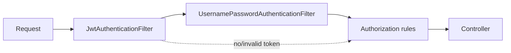

# Security

Stateless JWT authentication. No sessions, no cookies — every request carries its own credentials.

## The filter chain



`JwtAuthenticationFilter` runs **before** `UsernamePasswordAuthenticationFilter` and:

1. Reads the `Authorization` header; if it is absent or does not start with `Bearer `, passes the request straight through.
2. Extracts the subject claim — which is the user's **email**, because `User.getUsername()` returns `email`.
3. Loads the `UserDetails` and validates the token's signature and expiry.
4. On success, sets an authenticated token in the `SecurityContext`.
5. On failure, hands the exception to Spring's `HandlerExceptionResolver` rather than throwing.

A request without a valid token is not rejected by the filter — it simply stays anonymous and is rejected later by the authorization rules.

## Path rules

From `SecurityConfiguration.securityFilterChain`, in order:

| Pattern | Rule |
|---|---|
| `/auth/**` | Public |
| `/swagger-ui.html`, `/swagger-ui/**`, `/v3/api-docs`, `/v3/api-docs/**`, `/v3/api-docs.yaml` | Public |
| `/user/**` | `ROLE_USER` |
| `/admin/**` | `ROLE_ADMIN` |
| `/public/**` | Public |
| `/hello` | Public |
| everything else | Authenticated |

Plus method-level `@PreAuthorize("hasRole('ADMIN')")` on the three admin endpoints in `UserController`.

:::note `/user/**` and `/users/**` are different rules
`/user/**` (singular) covers only the `/user/dashboard` smoke-test endpoint. The real user API lives at `/users/**` (plural) and falls under `anyRequest().authenticated()`.
:::

## Roles

The [Flyway baseline](../data-model/schema.md) seeds `ADMIN` and `USER` into the `role` table, and `User` has a `@ManyToMany` to it. `getAuthorities()` prefixes each name with `ROLE_`.

Registration grants **`USER`** to every new account, so a freshly registered user holds `ROLE_USER` from the start.

:::note Granting ADMIN
There is no endpoint for it — do it directly:

```sql
INSERT INTO user_roles (user_id, role_id)
SELECT u.id, r.id FROM app_user u, role r
WHERE u.email = 'you@example.com' AND r.name = 'ADMIN';
```

This now survives a restart. It did not use to: `JPA_DDL_AUTO=create-drop` rebuilt the schema on every start, so hand-granted roles vanished.
:::

:::info Previously
Registration left `roles` empty, giving every account **zero** authorities. `/user/**`, `/admin/**` and all three `@PreAuthorize("hasRole('ADMIN')")` endpoints were unreachable by anyone. See [known issues](../reference/known-issues.md).
:::

## Tokens

| | |
|---|---|
| Algorithm | HS256 |
| Subject | The user's email |
| Lifetime | `JWT_EXPIRATION_MS`, 1 hour by default |
| Signing key | `JWT_SECRET`, **Base64-decoded** before use |

The key must decode to at least 32 bytes for HS256. `openssl rand -hex 32` produces a value that is both valid Base64 and long enough.

:::danger The default signing key is public
It is committed in `application.properties`. Anyone can mint valid tokens against a deployment that has not overridden `JWT_SECRET`. Rotate it before anything leaves your laptop.
:::

There is no refresh-token flow and no revocation list — a token is valid until it expires. Shortening `JWT_EXPIRATION_MS` is the only lever.

## Passwords

BCrypt via `BCryptPasswordEncoder`. Raw passwords are never stored.

Strength rules apply to **registration and reset alike**:

- ≥ `PASSWORD_MIN_LENGTH` characters (8)
- one uppercase letter, one digit, one special character

Failing them is a `400` with `error: "Password too weak"`. Registration used to enforce only `@NotBlank`, so an account could be created with a password its owner could never reset back to.

## Other posture notes

**CSRF is disabled** — correct for a stateless token API with no cookie auth.

**Sessions are `STATELESS`** — nothing is stored server-side between requests.

**CORS is applied** from a single `CorsConfigurationSource` bean driven by `CORS_ALLOWED_ORIGINS` and `CORS_ALLOWED_METHODS`. It previously existed but was never consulted, because the filter chain did not call `.cors(…)`.

**Security logging is at `DEBUG`** by default (`LOG_LEVEL_SECURITY`), which logs authentication detail on every request. Lower it to `WARN` outside development.

## Responses to expect

| Situation | Status |
|---|---|
| No token on a protected endpoint | `401` |
| Expired or malformed token | `401` |
| Valid token, wrong owner | `403` (`UnauthorizedAccessException`) |
| Valid token, missing role | `403` |

`JwtAuthenticationEntryPoint` produces the `401`s and `JwtAccessDeniedHandler` the role-based `403`s, both in the standard [error body](../api/errors.md). This split used to be inverted.
