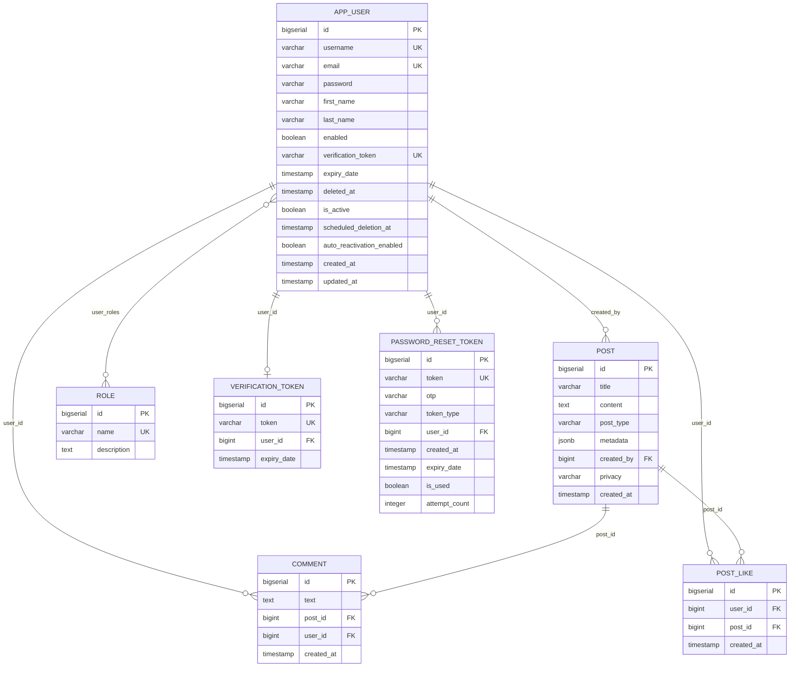

# Data model

Eight tables. PostgreSQL only — `post.metadata` uses `JSONB`.



:::warning The live schema is generated, not from `schema.sql`
`spring.sql.init.mode=never`, so [`schema.sql`](https://github.com/jomariabejo/connectly-api/blob/main/src/main/resources/schema.sql) is **never executed**. Hibernate builds the real schema from the entity classes according to `JPA_DDL_AUTO` (`create-drop` by default).

`schema.sql` is therefore reference documentation, and it has drifted: it declares `ON DELETE CASCADE` on three foreign keys that are `NO ACTION` in the generated schema, and names the verification column `verificationToken` where the entity produces `verification_token`. Trust the entities. See [known issues](../reference/known-issues.md).
:::

## `app_user`

The `User` entity — also Spring Security's `UserDetails`.

| Column | Type | Notes |
|---|---|---|
| `id` | `bigserial` | PK |
| `username` | `varchar` | Unique, not null |
| `email` | `varchar` | Unique, not null. **This is the login identifier** — `getUsername()` returns it |
| `password` | `varchar` | BCrypt hash |
| `first_name`, `last_name` | `varchar` | Nullable, filterable, never written after registration |
| `enabled` | `boolean` | `false` until email verification |
| `verification_token` | `varchar` | Unique; cleared once used |
| `expiry_date` | `timestamp` | Verification token expiry (24h) |
| `deleted_at` | `timestamp` | Soft delete — `null` means active |
| `is_active` | `boolean` | Query-friendly mirror of `deleted_at` |
| `scheduled_deletion_at` | `timestamp` | `deleted_at` + 30 days |
| `auto_reactivation_enabled` | `boolean` | Whether logging in restores the account |
| `created_at`, `updated_at` | `timestamp` | Hibernate `@CreationTimestamp` / `@UpdateTimestamp` |

**Soft delete is the pivot of this table.** Every repository query filters `deleted_at IS NULL` — see [Architecture](../architecture/overview.md).

## `post`

| Column | Type | Notes |
|---|---|---|
| `id` | `bigserial` | PK |
| `title` | `varchar(255)` | 5–100 chars enforced in the DTO |
| `content` | `text` | |
| `post_type` | `varchar(10)` | `CHECK IN ('text','image','video')` |
| `metadata` | `jsonb` | Free-form, defaults `{}`. Mapped with `@Type(JsonType.class)` from hibernate-types |
| `created_by` | `bigint` | FK → `app_user` |
| `privacy` | `varchar(10)` | `CHECK IN ('public','private')`, defaults `public` |
| `created_at` | `timestamp` | Defaults to `LocalDateTime.now()` in the entity |

`privacy` only affects [`GET /{postId}/likes/count`](../api/likes.md); every other read is owner-scoped regardless.

## `comment`

| Column | Type | Notes |
|---|---|---|
| `id` | `bigserial` | PK |
| `text` | `text` | Not null |
| `post_id` | `bigint` | FK → `post` |
| `user_id` | `bigint` | FK → `app_user` |
| `created_at` | `timestamp` | |

## `post_like`

| Column | Type | Notes |
|---|---|---|
| `id` | `bigserial` | PK |
| `user_id` | `bigint` | FK → `app_user` |
| `post_id` | `bigint` | FK → `post` |
| `created_at` | `timestamp` | |

`UNIQUE (user_id, post_id)` — a user can like a post at most once. That constraint is what makes [the toggle endpoint](../api/likes.md) safe.

## `role` and `user_roles`

| Column | Type | Notes |
|---|---|---|
| `role.id` | `bigserial` | PK |
| `role.name` | `varchar(50)` | Unique — `ADMIN`, `USER` |
| `role.description` | `text` | |
| `user_roles.user_id` | `bigint` | FK, composite PK |
| `user_roles.role_id` | `bigint` | FK, composite PK |

Many-to-many, fetched `EAGER`. `getAuthorities()` prefixes each name with `ROLE_`.

:::caution No rows are ever written to `user_roles`
`schema.sql` would seed the two roles, but it never runs — and nothing in the application assigns a role to a user anyway. Every account has zero authorities. See [Security](../architecture/security.md).
:::

## `verification_token`

| Column | Type | Notes |
|---|---|---|
| `id` | `bigserial` | PK |
| `token` | `varchar` | Unique |
| `user_id` | `bigint` | FK, unique — one token per user |
| `expiry_date` | `timestamp` | |

Written by `RegistrationListener` with a UUID **different** from the one on `app_user.verification_token`, and reused as the account-reactivation token after `DELETE /users/me`. See [Authentication](../api/authentication.md).

## `password_reset_token`

| Column | Type | Notes |
|---|---|---|
| `id` | `bigserial` | PK |
| `token` | `varchar` | Unique; set for the link flow |
| `otp` | `varchar(10)` | Set for the code flow |
| `token_type` | `varchar(50)` | `LINK` or `OTP` |
| `user_id` | `bigint` | FK — a user may have several |
| `created_at`, `expiry_date` | `timestamp` | 15-minute lifetime |
| `is_used` | `boolean` | Single-use enforcement |
| `attempt_count` | `integer` | Wrong OTP guesses; burned at 3 |

Swept hourly by [`PasswordResetTokenCleanupTask`](../architecture/scheduled-tasks.md).

## Indexes

From `schema.sql` (reference only — Hibernate generates its own):

```sql
CREATE INDEX idx_user_username ON app_user (username);
CREATE INDEX idx_user_email ON app_user (email);
CREATE INDEX idx_user_deleted_at ON app_user (deleted_at);
CREATE INDEX idx_user_scheduled_deletion_at ON app_user (scheduled_deletion_at);
CREATE INDEX idx_password_reset_token_user_id ON password_reset_token (user_id);
CREATE INDEX idx_password_reset_token_expiry_date ON password_reset_token (expiry_date);
```

`idx_user_deleted_at` matters most — every listing query filters on that column.

## Managing the schema for real

For anything beyond local development, set `JPA_DDL_AUTO=validate` and own the DDL yourself — Flyway or Liquibase rather than `schema.sql`, which nothing currently executes. See [Configuration](../getting-started/configuration.md).
